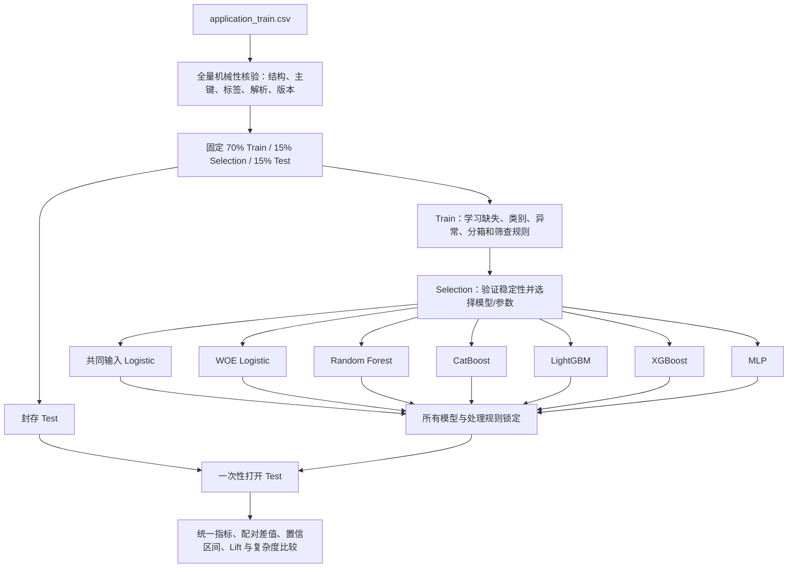

# Home Credit 信贷风险建模：统一数据流程与模型比较方案

## 1. 项目目标

本项目使用 Home Credit 的 `application_train.csv` 比较线性模型与非线性模型对违约风险排序能力的差异。

核心研究问题不是简单地找出 AUC 最高的模型，而是回答：

> 在相同样本、相同数据来源、相同信息集和相同评估规则下，非线性模型相对于线性模型带来了多少稳定、可信且具有业务意义的提升？

计划比较的模型包括：

- 线性基准：Logistic Regression。
- Bagging 非线性模型：Random Forest。
- Boosting 非线性模型：CatBoost、LightGBM、XGBoost。
- 神经网络非线性模型：MLP（多层感知机）。

当前项目主要比较模型的区分与排序能力，尚未把输出概率解释为已经校准的违约概率。`TARGET=1` 沿用原数据的“发生偿付困难”定义，不自行改写为未经数据验证的“未来 12 个月 90+ 逾期”。

## 2. 当前文件

| 文件 | 作用 | 当前定位 |
|---|---|---|
| [`统一建模前数据探查_PSI_缺失_类别_异常.ipynb`](./统一建模前数据探查_PSI_缺失_类别_异常.ipynb) | 数据核验、固定切分、缺失/类别/异常/PSI、统一变量清单 | 公共数据层 |
| [`逻辑回归.ipynb`](./逻辑回归.ipynb) | WOE/IV、相关性、VIF、P-value、Logistic Regression | 线性/评分卡基准 |
| [`catboost最终版.ipynb`](./catboost最终版.ipynb) | 原生类别变量、分轮搜索、Early Stopping、SHAP | CatBoost 正式稿基础 |
| [`LightGBM_信贷违约风控_完整建模.ipynb`](./LightGBM_信贷违约风控_完整建模.ipynb) | 完整搜索、锁模、Test 评估、稳定性、解释与保存 | LightGBM 正式稿 |
| [`XGBoost_信贷违约风控_完整建模.ipynb`](./XGBoost_信贷违约风控_完整建模.ipynb) | 完整搜索、锁模、Test 评估、稳定性、解释与保存 | XGBoost 正式稿 |
| `RandomForest_信贷违约风控_完整建模.ipynb` | 待建立 | Random Forest 正式稿 |
| `MLP_信贷违约风控_完整建模.ipynb` | 待建立 | 神经网络正式稿 |

`逻辑回归.ipynb` 前半部分包含 LightGBM、XGBoost、Random Forest、CatBoost 和 MLP 的学习性演示。那些单元适合理解算法和 Pipeline，但不应把其中的汇总表直接当作最终公平比较结果。正式比较应使用各模型独立、锁定规则后的结果。

## 3. 为什么需要两条实验线

当前四份代码的特征政策并不完全相同：

- 正式 Logistic Regression 使用固定比例特征、WOE/IV、相关性、VIF、P-value 和系数方向筛选。
- CatBoost 正式稿主要使用原始字段和原生类别处理。
- LightGBM/XGBoost 使用时间变量转换、比例特征、`DAYS_EMPLOYED=365243` 特殊值处理，并默认排除 `CODE_GENDER`。
- XGBoost 使用 Train 拟合的 One-Hot；LightGBM 和 CatBoost 使用原生类别能力。

如果直接比较当前 Notebook 的 Test AUC，差异同时包含了“算法差异”和“特征/预处理差异”，不能完全归因于非线性能力。因此正式报告应同时提供两条实验线。

### 3.1 主实验：严格可比的算法对照

目的：尽量隔离“线性与非线性表达能力”的差异。

必须统一：

- 同一源数据和数据 SHA256。
- 同一 Train/Selection/Test 行索引。
- 同一原始信息集和排除字段。
- 同一固定、逐行的特征工程。
- 同一基础质量筛查政策。
- 同一 Selection 选模原则。
- 同一 Test 指标和置信区间计算方法。

模型可以使用满足算法要求的不同编码方式，例如 Logistic/Random Forest/MLP 使用 One-Hot，CatBoost/LightGBM 使用原生类别；但编码必须只在 Train 上拟合，且不得为某个模型额外提供其他模型没有的原始信息。

主实验建议增加一个“共同输入 Logistic Regression”：对统一候选变量执行 Train 中位数填补、缺失类别、One-Hot 和数值标准化，再使用带正则化的 Logistic Regression。它与非线性模型使用同一信息集，是回答“非线性本身提升多少”的主要线性对照。

### 3.2 补充实验：每个模型的最佳实践

目的：比较各类方法按照自身特点完整开发后能达到的最佳效果。

- Logistic Regression 可以使用 WOE/IV、单调分箱、VIF、P-value 和系数方向约束。
- CatBoost 可以使用原生类别变量、有序目标统计和对称树。
- LightGBM 可以使用原生类别变量和 leaf-wise 生长。
- XGBoost 可以使用当前明确保存的 One-Hot 规则和 depth-wise 生长。
- Random Forest 可以通过树数量、叶节点样本数和特征采样控制方差。
- MLP 可以使用标准化、非线性隐藏层、正则化和 Early Stopping。

这条实验线代表“完整方案能力”，但结果差异不能全部解释成算法非线性带来的提升。

## 4. 总体流程



## 5. 数据与样本角色

### 5.1 数据源

- 数据路径：`/Users/ganlu/Desktop/home-credit-risk-english/data/application_train.csv`
- 当前数据规模：307,511 行、122 列。
- 标签：`TARGET`，当前坏样本率约 8.07%。
- 客户主键：`SK_ID_CURR`，不进入模型。
- 当前数据 SHA256：`52e96b895b1112e1c853f670e58372719c8441c5ed1c57ac2f7fad559d784f5f`。

每次正式运行都要重新核对数据 SHA256。文件名相同不代表文件内容相同。

### 5.2 三份样本的职责

| 样本 | 比例 | 可以做什么 | 不可以做什么 |
|---|---:|---|---|
| Train | 70% | 学习填补值、标准化参数、类别集合、分箱、WOE、特征筛查、模型权重 | 根据 Selection/Test 反向修改 Train 数据 |
| Selection | 15% | Early Stopping、超参数选择、过拟合 gap、辅助稳定性检查、固定业务阈值 | 参与拟合预处理统计量；冒充最终泛化结果 |
| Test | 15% | 所有模型锁定后做一次最终评估、置信区间、Lift、漂移和解释 | 用于调参、选变量、选模型、改异常处理或反复尝试 |

统一切分使用两次分层随机抽样：

```text
random_state = 42
Train = 70%
Selection = 15%
Test = 15%
stratify = TARGET
```

正式模型应读取 [`统一数据探查产物/split_indices.npz`](./统一数据探查产物/split_indices.npz)，而不是在每个 Notebook 中独立重新随机切分。还应同时核对 [`统一数据探查产物/manifest.json`](./统一数据探查产物/manifest.json) 的数据路径、哈希、行数和随机种子。

### 5.3 “全量数据探查”的边界

在切分前可以对全量数据执行不会影响建模选择的机械性核验：

- 文件、字段、类型和编码能否正确读取。
- 主键为空、重复、行数和时间范围。
- 标签是否只包含合法值。
- 列名是否重复、数值是否无法解析。
- 数据版本和来源指纹。

以下统计会影响变量与处理规则，应在 Train 上学习，并用 Selection 辅助验证：

- 缺失与非缺失坏样本率。
- 异常值、截尾和分位数边界。
- 稀有类别合并和未见类别策略。
- PSI 分箱、WOE/IV、相关性、VIF、P-value。
- 任何可能导致删除变量或改变编码的结果。

Test 的缺失漂移、未见类别、数值越界、输入 PSI 和分数 PSI都应在锁模后生成。

## 6. 统一公共数据层

### 6.1 固定的逐行特征工程

为使主实验的信息集一致，建议所有模型统一采用 LightGBM/XGBoost 正式稿中已经实现的固定规则：

1. 将数值正负无穷转换为缺失。
2. 将 `DAYS_EMPLOYED=365243` 识别为特殊占位值：
   - 创建 `EMPLOYED_SPECIAL_FLAG`。
   - 将原值转为缺失后再进行年限转换。
3. 将五个负天数字段转换为更容易解释的年限：
   - `DAYS_BIRTH → AGE_YEARS`
   - `DAYS_EMPLOYED → EMPLOYED_YEARS`
   - `DAYS_REGISTRATION → REGISTRATION_YEARS`
   - `DAYS_ID_PUBLISH → ID_PUBLISH_YEARS`
   - `DAYS_LAST_PHONE_CHANGE → PHONE_CHANGE_YEARS`
4. 生成六个比例特征：
   - `CREDIT_INCOME_RATIO`
   - `ANNUITY_INCOME_RATIO`
   - `CREDIT_ANNUITY_RATIO`
   - `GOODS_CREDIT_RATIO`
   - `INCOME_PER_PERSON`
   - `EMPLOYED_AGE_RATIO`
5. 比率分母为 0 或缺失时保留为缺失，不把“无法计算”改成真实的 0。
6. 转换后删除对应的五个原始 `DAYS_*` 字段，避免同义信息重复。

以上规则只依赖单行字段，不需要从全体样本估计参数，因此可以一致地应用于 Train、Selection、Test 和未来客户。

### 6.2 公共排除字段

- `TARGET`：标签，不进入特征。
- `SK_ID_CURR`：主键，不进入特征。
- `CODE_GENDER`：LightGBM/XGBoost 当前默认排除。为了主实验公平，应统一决定所有模型都排除或都保留；建议主实验全部排除，并在补充实验中单独记录敏感变量政策。

### 6.3 基础质量筛查

公共层只负责模型无关的质量判断：

- 全缺失。
- 常量。
- 高度疑似 ID 的类别变量。
- 高缺失率提示。
- 近常量提示。
- 低基数数值字段的类型复核。
- 已知特殊占位值和业务规则异常。

高缺失、近常量、PSI 偏高和统计离群不应被默认自动删除。若决定删除近常量字段，必须把规则版本化并同时应用于全部模型。

统一清单以 [`统一数据探查产物/11_feature_decision_report.csv`](./统一数据探查产物/11_feature_decision_report.csv) 和 [`统一数据探查产物/feature_policy.json`](./统一数据探查产物/feature_policy.json) 为准。

## 7. 各模型分别负责什么

### 7.1 共同输入 Logistic Regression：主线性对照

这一版本需要单独建立，目的不是制作传统评分卡，而是为非线性模型提供公平的线性基准。

建议 Pipeline：

- 数值字段：Train 中位数填补 → `StandardScaler`。
- 类别字段：Train 学习缺失类别和 One-Hot，未知类别 `handle_unknown='ignore'`。
- 模型：带 L2 正则的 Logistic Regression。
- Selection 搜索：`C`、L1/L2（若使用 L1，选择兼容 solver）、类别稀有合并阈值。
- 输出：系数、方向、Selection 指标、锁定配置和 Test 预测。

它与树模型使用相同信息集，因此非线性模型相对这一版本的差值最接近“非线性表达能力的增量”。

### 7.2 WOE Logistic Regression：解释性/评分卡基准

当前 `逻辑回归.ipynb` 的正式 LR 部分已经包含：

- 固定时间和比例特征。
- `DAYS_EMPLOYED=365243` 转为缺失。
- 数值变量 Train 等频初始分箱和单调合并。
- 缺失单独成箱，小缺失箱做保护性处理。
- 类别变量缺失成箱和稀有类别合并。
- WOE 与 IV；当前 IV 门槛为 `0.02`。
- 单变量 AR。
- WOE 相关性筛查；当前阈值 `0.70`，AR 差异门槛 `0.03`。
- VIF；当前门槛 `10`。
- P-value；当前门槛 `0.05`。
- 可选的正系数方向约束。
- 最终使用 `penalty=None` 的 Logistic Regression 拟合筛选后的 WOE 变量。

这个版本适合回答“传统可解释风控模型表现如何”，但由于它的特征选择和 WOE 变换具有强烈模型特色，不应作为唯一的非线性增量对照。

### 7.3 Random Forest：Bagging 非线性基准

当前逻辑回归 Notebook 中的 Random Forest 是演示稿，正式版应独立实现。

建议保持现有 Pipeline 思路：

- 类别变量：Train 拟合的 One-Hot，使用稀疏矩阵，未知类别忽略。
- 数值变量：中位数填补；树模型不需要标准化。
- 禁止把含大量 One-Hot 的宽表无条件转换为 dense，以免内存失控。
- 模型：`RandomForestClassifier`。

分轮搜索建议：

1. 树数量：先把 `n_estimators` 提高到指标基本稳定，例如 300/500/800。
2. 结构复杂度：`max_depth`、`min_samples_leaf`、`min_samples_split`。
3. 随机化：`max_features`、`max_samples`、`bootstrap`。
4. 类别不平衡策略：主实验保持与其他模型一致；`class_weight='balanced'` 作为预先声明的补充实验，不能看 Test 后再决定。

Random Forest 的主要作用是判断：不依赖 Boosting 的普通树集成能否已经捕捉到明显的非线性增量，以及 Boosting 相对 Bagging 又提升了多少。

### 7.4 CatBoost：原生类别与对称树

当前正式稿已经采用：

- 类别变量缺失填为显式字符串。
- `Pool` 和原生 `cat_features`。
- Bernoulli bootstrap。
- Selection AUC Early Stopping。
- 第一轮搜索 `depth`。
- 第二轮联合搜索相邻 `depth × learning_rate × l2_leaf_reg`。
- 第三轮搜索 `subsample × rsm × random_strength`。
- 在 Selection AR 距最优不超过 `0.005` 的候选中，优先选择 Train–Selection gap 更小、深度更浅、树数更少的模型。
- 锁定参数与最佳树数后只在 Train 上重训。
- 锁模后评估 Test、输入 PSI、特征重要性和 SHAP。

主实验中应让 CatBoost 使用与其他模型相同的公共原始信息集和固定比例特征，而类别编码仍保留 CatBoost 原生方式。

### 7.5 LightGBM：leaf-wise Boosting

当前完整稿已经实现较严格的正式流程：

- 固定特征工程和 `EMPLOYED_SPECIAL_FLAG`。
- Train 学习类别集合，LightGBM 原生类别输入。
- 原生缺失值，真实 0 不当作缺失。
- Baseline 后分三轮搜索：
  1. `num_leaves × max_depth × min_child_samples`。
  2. `learning_rate × reg_lambda`，保留多个复杂度锚点。
  3. `subsample × colsample_bytree × reg_alpha × min_split_gain`。
- Early Stopping 监控 Selection AUC。
- 选择规则：Selection AR 接近最优时，优先较小 gap、较低容量、较少树数。
- 固定参数与树数，只在 Train 上重训并验证 Selection 复现性。
- 锁模后输出 AUC/AR/KS/AP/Logloss、Bootstrap 区间、风险十分组、Lift、固定审核阈值、PSI、gain importance、Tree SHAP、模型包和独立评分脚本。

LightGBM 主要代表高效率、leaf-wise 的梯度提升树。

### 7.6 XGBoost：depth-wise Boosting

当前完整稿与 LightGBM 使用相同的项目骨架和固定特征工程，主要差异是：

- Train 学习类别集合并使用 One-Hot。
- 使用 dense `float32` 矩阵并设置内存保护上限；真实 0 与缺失值保持区分。
- 第一轮搜索 `max_depth × min_child_weight`。
- 第二轮搜索 `learning_rate × reg_lambda`。
- 第三轮搜索 `subsample × colsample_bytree × reg_alpha × gamma`。
- 使用 depth-wise 生长和直方图算法。
- 锁模、指标、Bootstrap、Lift、PSI、total gain、原生 Tree SHAP、保存与回读流程与 LightGBM 基本一致。

XGBoost 与 LightGBM 的对比可以进一步回答：在同属 Boosting 的情况下，树生长方式和正则机制带来多少差异。

### 7.7 MLP：神经网络非线性基准

当前逻辑回归 Notebook 中已有 `(64, 32)`、ReLU 的 `MLPClassifier` 演示，但正式版需要补足验证、正则化和可复现流程。

建议 Pipeline：

- 数值变量：Train 中位数填补 → `StandardScaler`。
- 类别变量：缺失类别 → Train One-Hot；输出优先使用稀疏矩阵并确认当前实现是否会转 dense。
- 模型：`MLPClassifier` 或可明确控制训练循环的 PyTorch MLP。
- 隐藏层：从小结构开始，例如 `(64,)`、`(64, 32)`、`(128, 64)`。
- 激活函数：ReLU。
- 搜索：隐藏层、`alpha`、`learning_rate_init`、batch size。
- Early Stopping：只使用 Train 内部划出的验证子集，或者在自定义训练循环中监控 Selection；两种方案必须预先固定一种。
- 固定随机种子、最大 epoch 和停止规则。
- 锁定架构与 epoch 后重新拟合，不得根据 Test loss 修改网络。

MLP 的作用是检验：表格型信贷数据上的通用神经网络是否能稳定超过线性模型，以及它相对专门的树模型是否有优势。

## 8. 统一选模规则

### 8.1 Baseline → 分轮搜索 → 锁模

所有非线性模型尽量沿用当前 CatBoost/LightGBM/XGBoost 的结构：

1. 跑固定 Baseline，确认数据和指标链路正确。
2. 第一轮搜索模型容量。
3. 第二轮搜索学习速度和主要正则化。
4. 第三轮搜索采样、随机性和次级正则化。
5. 将全部轮次候选合并，不默认认为最后一轮一定最好。
6. 使用 Selection 选择候选。
7. 固定参数、预处理规则和训练轮数。
8. 只用 Train 重新训练并验证 Selection 指标可复现。
9. 所有模型都锁定后，才统一打开 Test。

### 8.2 候选选择原则

当前 Boosting Notebook 使用的思想可以推广到全部模型：

1. 先找到最高 Selection AR。
2. 保留与最优值相差不超过 `AR_TOLERANCE=0.005` 的候选。
3. 在入围候选中优先选择 Train–Selection AR gap 更小的模型。
4. gap 接近时，选择容量更小、结构更简单、训练成本更低的模型。

这比单纯选择 Selection AR 最高的一行更不容易追逐抽样噪声。

### 8.3 调参预算公平

不能给某个模型搜索数百组参数，却只给另一个模型一个默认参数，然后把差异全部归因于算法。

至少需要记录：

- 候选组合数量。
- 每组最大迭代/树数量。
- Early Stopping 规则。
- 总训练时间和峰值内存。
- 随机种子。
- 是否达到最大迭代上限。

不要求每个模型耗时完全相等，但必须保证每个模型都经过合理、预先定义的搜索。

## 9. 统一评估指标

### 9.1 主指标

| 指标 | 作用 |
|---|---|
| AUC | 衡量好坏样本排序能力，主比较指标 |
| AR | `2 × AUC - 1`，风控中常用的 AUC 等价表达 |
| KS | 最大累计好坏样本分离度 |
| AP | 类别不平衡下对坏样本识别更敏感 |
| Logloss | 检查概率质量；当前未校准时只能辅助解释 |

坏样本率只有约 8%，因此 Accuracy 不作为主要指标。只预测所有客户为好样本也可能获得很高 Accuracy，但没有风险排序价值。

### 9.2 泛化与过拟合

每个模型都应报告：

- Train、Selection、Test 的 AUC/AR/KS/AP/Logloss。
- Train–Selection AR gap。
- Train–Test AR gap。
- 最佳迭代数或模型容量。
- 是否触及最大迭代上限。

### 9.3 业务排序表现

沿用 LightGBM/XGBoost 当前实现：

- Test 风险十分组。
- 各组坏样本率和 Lift。
- 累计坏样本捕获率。
- 从 Selection 固定最高风险约 10% 的审核阈值，再原样应用于 Test。
- Test 标记率、坏样本捕获率、标记客群坏样本率和好客户误标率。

阈值演示不是正式拒贷政策，不能只根据模型排序指标直接转成授信策略。

## 10. 如何计算“非线性提升”

以同一批 Test 客户上的共同输入 Logistic 为主要基准：

```text
ΔAUC(model) = AUC(model) - AUC(common-input Logistic)
ΔAR(model)  = AR(model)  - AR(common-input Logistic)
ΔKS(model)  = KS(model)  - KS(common-input Logistic)
```

由于所有模型预测的是同一批客户，统计比较应采用配对方法，而不是分别计算两个互不相关的区间：

1. 在 Test 内分层、有放回地同时抽取同一组客户索引。
2. 对每次 Bootstrap 同时计算 Logistic 和目标模型指标。
3. 保存每次的指标差值。
4. 使用差值的 2.5% 和 97.5% 分位数作为 95% 置信区间。

若 `ΔAUC` 或 `ΔAR` 的区间跨过 0，只能说点估计更高，不能声称已经证明模型稳定提升。

最终结论应同时回答：

- 提升的绝对百分点是多少，而不只写相对百分比。
- 置信区间是否支持稳定提升。
- Lift 和高风险客群捕获率是否同步改善。
- Train–Selection/Test gap 是否恶化。
- 提升是否值得增加解释、部署、维护和计算成本。

## 11. 最终比较表建议

最终汇总表至少包含以下字段：

| model | experiment_track | feature_policy | encoded_features | best_iteration_or_trees | train_AR | selection_AR | test_AUC | test_AR | test_KS | test_AP | test_Logloss | ΔAUC_vs_common_LR | ΔAUC_95%CI | top_decile_lift | train_seconds |
|---|---|---|---:|---:|---:|---:|---:|---:|---:|---:|---:|---:|---|---:|---:|
| Common-input Logistic | controlled | common |  |  |  |  |  |  |  |  |  | 0 | reference |  |  |
| WOE Logistic | best-practice | WOE/IV/VIF |  |  |  |  |  |  |  |  |  |  |  |  |  |
| Random Forest | controlled | common |  |  |  |  |  |  |  |  |  |  |  |  |  |
| CatBoost | controlled | common |  |  |  |  |  |  |  |  |  |  |  |  |  |
| LightGBM | controlled | common |  |  |  |  |  |  |  |  |  |  |  |  |  |
| XGBoost | controlled | common |  |  |  |  |  |  |  |  |  |  |  |  |  |
| MLP | controlled | common |  |  |  |  |  |  |  |  |  |  |  |  |  |

不要只保留 Test 指标。Selection 表现、gap、模型容量和运行成本是判断提升是否可靠的重要证据。

## 12. 解释与模型治理

各模型使用适合自己的解释方式，但最终都应回到原始业务变量层：

- Logistic：系数、WOE、IV、VIF、P-value 和方向。
- Random Forest：Permutation Importance 优先；内置 impurity importance 仅作辅助。
- CatBoost：原生特征重要性和 SHAP。
- LightGBM：total gain、split count 和 Tree SHAP。
- XGBoost：total gain 和 Tree SHAP；One-Hot SHAP 需先聚合回原始字段。
- MLP：Permutation Importance；如使用 SHAP，需说明背景样本和近似方法。

比较解释结果时，应检查：

- 非线性模型的主要风险变量是否与业务常识一致。
- 不同模型是否依赖完全不同的变量。
- 模型是否过度依赖高缺失、代理变量或特殊占位值。
- `CODE_GENDER` 等敏感/代理字段的使用政策是否一致。

## 13. 输出与复现要求

每个正式模型运行目录建议至少保存：

```text
model_outputs/<model>/<run_id>/
├── locked_config.json
├── data_and_split_fingerprint.json
├── preprocess_spec.*
├── feature_list.json
├── feature_drop_report.csv
├── search_checkpoint.csv
├── all_search_results.csv
├── final_metrics.csv
├── test_predictions.csv
├── risk_deciles.csv
├── psi_report.csv
├── feature_importance.csv
├── shap_importance.csv
├── model_file
└── scoring.py
```

`test_predictions.csv` 应至少包含：

```text
SK_ID_CURR, TARGET, prediction
```

最终比较程序按 `SK_ID_CURR` 合并所有模型的 Test 预测，必须验证：

- 每个模型行数相同。
- ID 唯一且集合完全一致。
- TARGET 完全一致。
- 预测均为有限的 `[0, 1]` 数值。
- 没有因缺失处理失败而静默删行。

## 14. 推荐执行顺序

### 阶段 A：冻结公共规则

- [ ] 确认源数据和 SHA256。
- [ ] 确认 `TARGET` 与 `SK_ID_CURR` 定义。
- [ ] 冻结 Train/Selection/Test 索引。
- [ ] 冻结公共排除字段。
- [ ] 冻结固定时间/比例特征工程。
- [ ] 冻结基础质量筛查政策。
- [ ] 建模前只输出 Train 与 Selection 的统计型探查结果。

### 阶段 B：建立主线性基准

- [ ] 完成共同输入 Logistic。
- [ ] 完成当前 WOE Logistic 正式结果。
- [ ] 两个线性模型都只使用 Train/Selection 选择规则。

### 阶段 C：锁定非线性模型

- [ ] Random Forest。
- [ ] CatBoost。
- [ ] LightGBM。
- [ ] XGBoost。
- [ ] MLP。
- [ ] 确认所有候选搜索与锁定配置已保存。
- [ ] 在此阶段结束前不查看 Test 派生指标。

### 阶段 D：一次性最终比较

- [ ] 一次性为所有锁定模型生成 Test 预测。
- [ ] 计算统一指标和风险十分组。
- [ ] 计算相对共同输入 Logistic 的配对 Bootstrap 差值。
- [ ] 输出受控主实验表与最佳实践补充表。
- [ ] 完成复杂度、解释性、稳定性和业务收益讨论。

## 15. 当前状态与需要注意的限制

1. LightGBM 和 XGBoost 已经具备最完整的锁模、Test、Bootstrap、Lift、PSI、SHAP、保存和回读框架，可作为其他模型正式稿的代码模板。
2. CatBoost 已有分轮搜索和锁模逻辑，但产物保存、独立评分和回读验证还需要向 LightGBM/XGBoost 对齐。
3. 当前 WOE Logistic 是很好的评分卡基准，但仍建议增加共同输入 Logistic，才能更干净地衡量非线性增量。
4. Random Forest 和 MLP 目前只是逻辑回归 Notebook 中的演示代码，不应进入最终对比表，需建立独立正式 Notebook。
5. 当前统一数据探查 Notebook 已经计算过 Test PSI、Test 缺失漂移、Test 未见类别和 Test 数值越界。以后正式流程应将这些单元移动到所有模型锁定之后。
6. 当前各 Notebook 在开发阶段已经展示过 Test 结果。课程项目可以继续使用并如实说明；若需要更严格的无偏研究结论，应在开始最终比较前重新指定一份未查看的最终 Holdout，或者采用预先定义的嵌套交叉验证方案。
7. 当前模型均未做正式概率校准。AUC/AR/KS 的排序比较仍然有效，但不能直接把原始输出当作经过验证的 PD。

## 16. 最终报告应回答的问题

项目完成时，不应只写“XGBoost 最好”或“神经网络没有树模型好”，而应完整回答：

1. 共同输入 Logistic 的 Test AUC/AR/KS 是多少？
2. 每个非线性模型相对它提升了多少绝对百分点？
3. 配对置信区间是否支持这种提升不是抽样偶然？
4. Random Forest 与 Boosting 的差距是多少？
5. CatBoost、LightGBM、XGBoost 的差异来自哪里？
6. MLP 在表格型信贷数据上是否获得稳定增益？
7. WOE Logistic 与共同输入 Logistic 的差异是多少，评分卡筛选带来了收益还是损失？
8. 非线性提升是否伴随更严重的 Train–Selection/Test gap？
9. 高风险十分组 Lift 和坏样本捕获率是否同步提升？
10. 提升是否足以补偿解释、部署、监控和维护复杂度？

只有在统一数据、统一切分、统一信息集和 Test 封存的前提下，这些答案才能真正支持“非线性模型相对线性模型的提升”这一结论。
